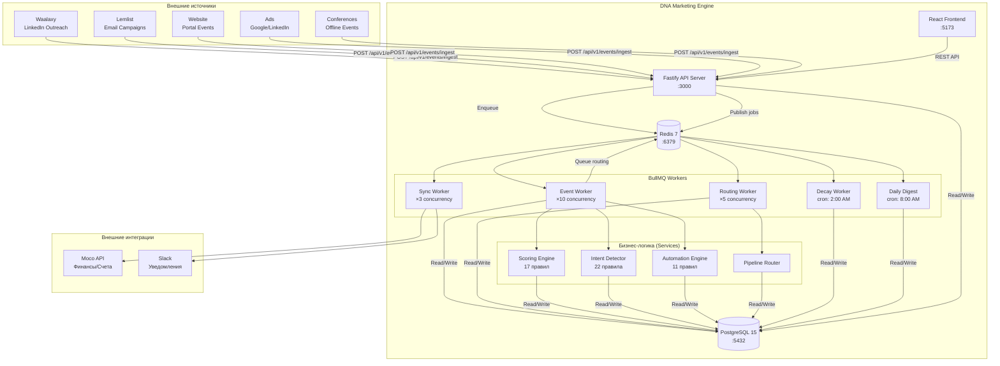
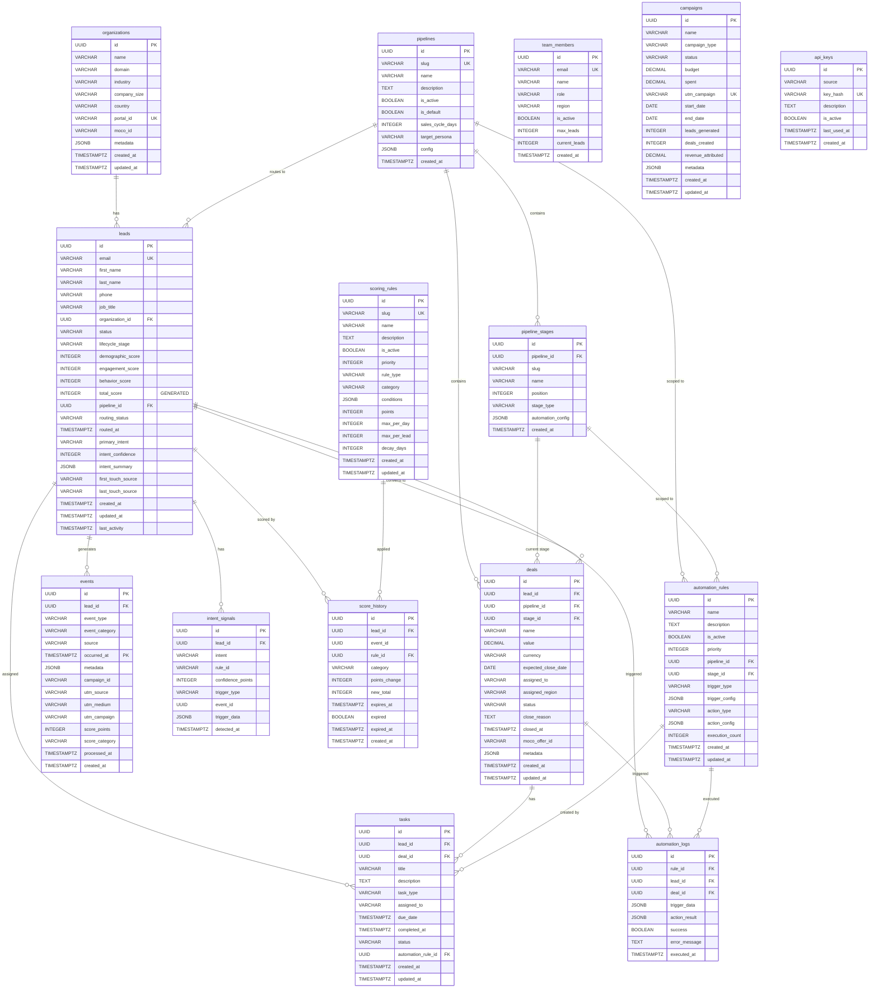
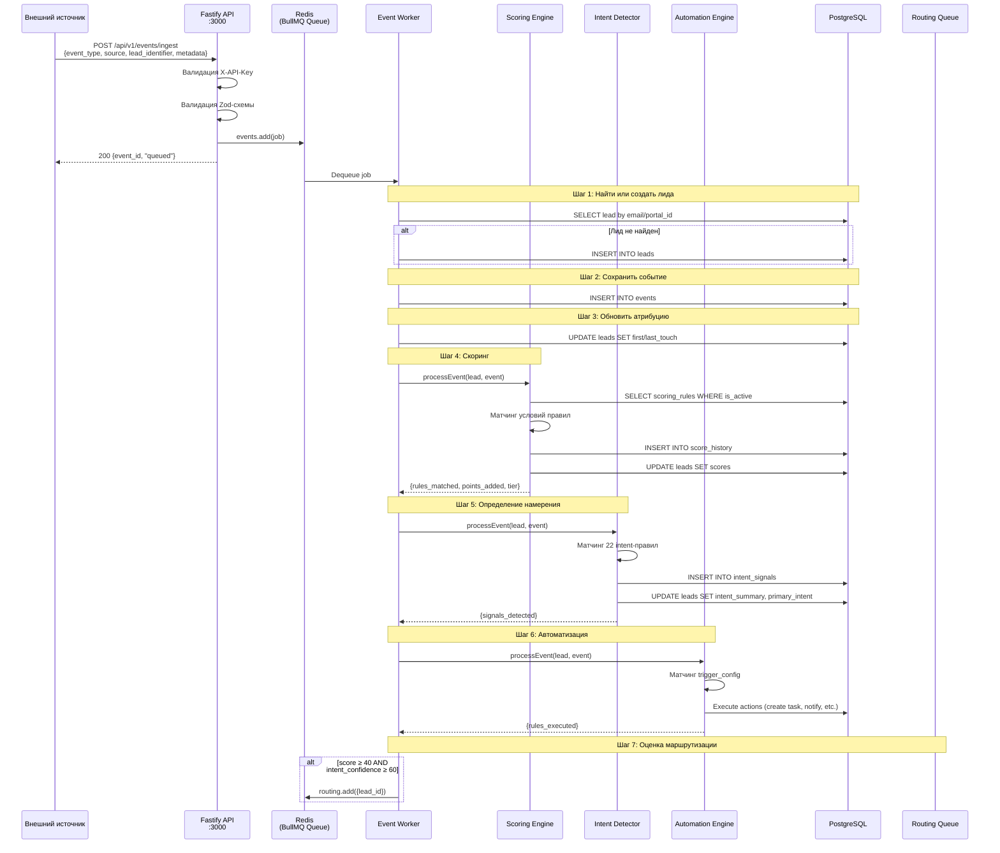
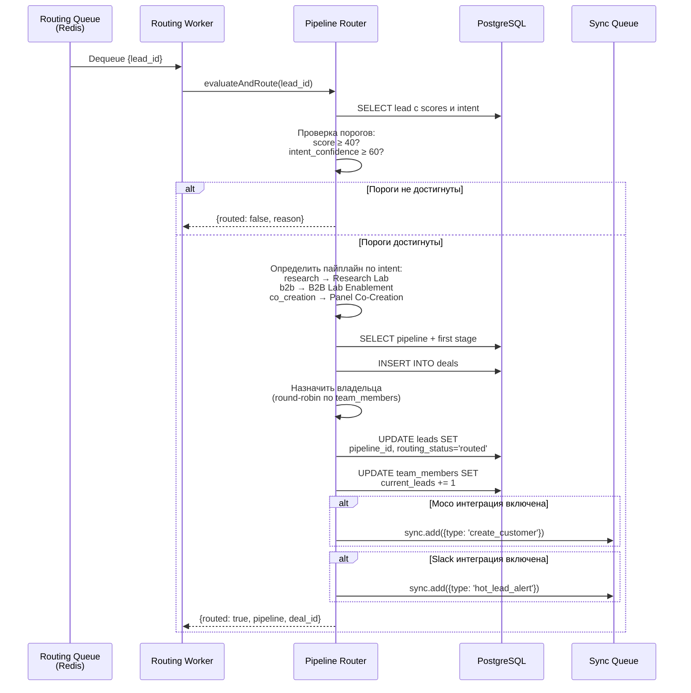
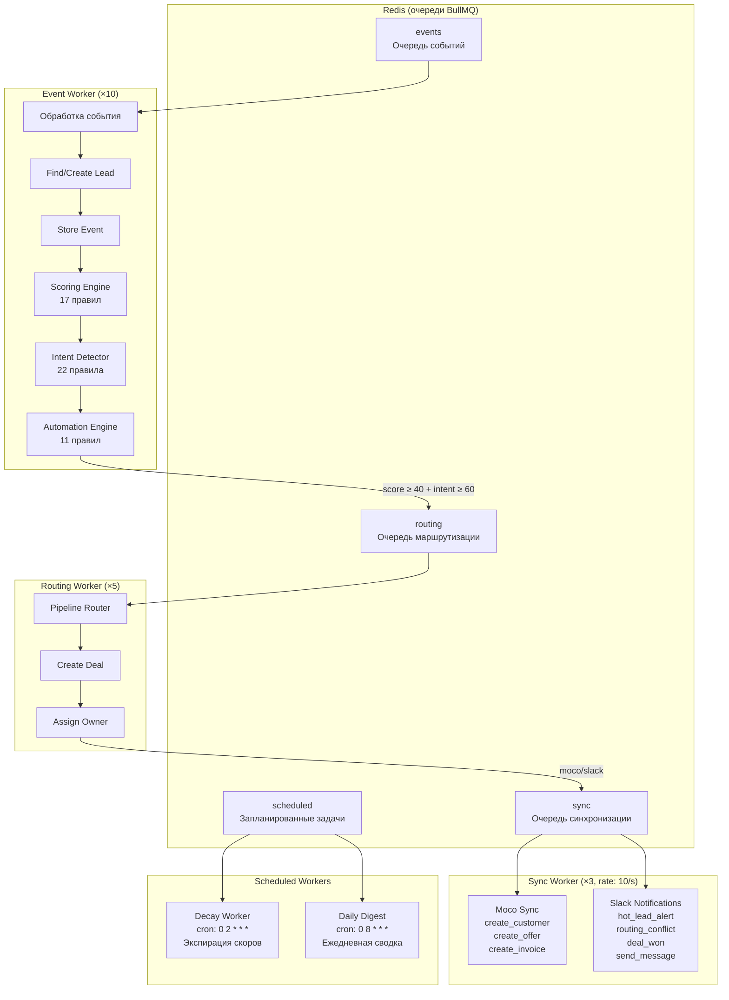
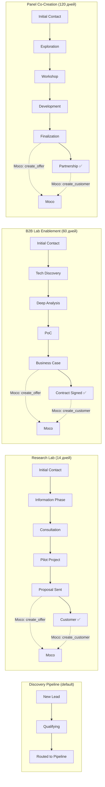

# DNA Marketing Engine — Архитектура

## Содержание

1. [Обзор системы](#1-обзор-системы)
2. [Диаграмма компонентов системы](#2-диаграмма-компонентов-системы)
3. [Схема базы данных (ER-диаграмма)](#3-схема-базы-данных-er-диаграмма)
4. [Описание таблиц](#4-описание-таблиц)
5. [Поток данных: обработка события](#5-поток-данных-обработка-события)
6. [Поток данных: маршрутизация лида](#6-поток-данных-маршрутизация-лида)
7. [Архитектура воркеров (BullMQ)](#7-архитектура-воркеров-bullmq)
8. [Компоненты фронтенда](#8-компоненты-фронтенда)
9. [Конфигурация пайплайнов](#9-конфигурация-пайплайнов)
10. [API-эндпоинты](#10-api-эндпоинты)

---

## 1. Обзор системы

DNA Marketing Engine — CRM-платформа для биотех-индустрии. Система принимает маркетинговые события из внешних каналов, скорит лидов, определяет их намерение (intent) и автоматически маршрутизирует в нужный пайплайн продаж.



---

## 2. Диаграмма компонентов системы

```mermaid
graph LR
    subgraph "Frontend (React + Vite :5173)"
        APP[App.jsx<br/>React Admin]
        DP[dataProvider.js<br/>API Client]
        AP[authProvider.js<br/>Dev Auth]
        APP --> DP & AP
    end

    subgraph "Backend API (Fastify :3000)"
        direction TB
        MW[Middleware<br/>API Key / HMAC / Error]

        subgraph "API Routes"
            R_EV[/events]
            R_LE[/leads]
            R_DE[/deals]
            R_PI[/pipelines]
            R_SC[/scoring]
            R_RO[/routing]
            R_TA[/tasks]
            R_TE[/team]
            R_AU[/automation]
            R_CA[/campaigns]
            R_GD[/gdpr]
            R_RE[/reports]
            R_IN[/integrations]
        end

        subgraph "Services"
            S_LE[LeadService]
            S_DE[DealService]
            S_PI[PipelineService]
            S_TA[TaskService]
            S_SC[ScoringEngine]
            S_ID[IntentDetector]
            S_AE[AutomationEngine]
            S_PR[PipelineRouter]
            S_RP[ReportService]
        end
    end

    subgraph "Workers (BullMQ)"
        W_EV[EventWorker]
        W_RO[RoutingWorker]
        W_SY[SyncWorker]
        W_DC[DecayWorker]
        W_DD[DailyDigest]
    end

    subgraph "Инфраструктура"
        PG[(PostgreSQL 15)]
        RD[(Redis 7)]
    end

    subgraph "Внешние API"
        MOCO[Moco]
        SLACK[Slack]
    end

    DP -->|HTTP| MW
    MW --> R_EV & R_LE & R_DE & R_PI & R_SC & R_RO & R_TA & R_TE & R_AU & R_CA & R_GD & R_RE & R_IN
    R_EV & R_LE --> S_LE
    R_DE --> S_DE
    R_PI --> S_PI
    R_TA --> S_TA
    R_SC --> S_SC
    R_RO --> S_PR
    R_RE --> S_RP
    S_LE & S_DE & S_PI & S_TA & S_SC & S_ID & S_AE & S_PR & S_RP --> PG
    R_EV -->|Enqueue| RD
    W_EV --> S_SC & S_ID & S_AE
    W_RO --> S_PR
    W_SY --> MOCO & SLACK
    W_EV & W_RO & W_SY & W_DC & W_DD --> PG
    RD --> W_EV & W_RO & W_SY & W_DC & W_DD
```

---

## 3. Схема базы данных (ER-диаграмма)



---

## 4. Описание таблиц

### Основные сущности

| Таблица | Назначение | Ключевые поля |
|---------|-----------|---------------|
| `organizations` | Компании, к которым привязаны лиды | `name`, `domain`, `industry`, `portal_id`, `moco_id` |
| `leads` | Контакты/лиды — центральная сущность | `email`, scores (3 категории + total), `routing_status`, `primary_intent`, `intent_confidence`, `intent_summary` |
| `pipelines` | Воронки продаж (Discovery, Research Lab, B2B, Co-Creation) | `slug`, `is_default`, `sales_cycle_days`, `target_persona` |
| `pipeline_stages` | Этапы внутри каждого пайплайна (3-7 этапов) | `position`, `stage_type` (awareness→closed_won/lost), `automation_config` |
| `deals` | Сделки — создаются при маршрутизации лида в пайплайн | `lead_id`, `pipeline_id`, `stage_id`, `value`, `assigned_to`, `status` |
| `events` | Маркетинговые события (партицирована по месяцам) | `event_type`, `source`, `occurred_at`, `metadata`, UTM-метки |

### Скоринг и интент

| Таблица | Назначение | Ключевые поля |
|---------|-----------|---------------|
| `scoring_rules` | Правила начисления баллов (17 правил) | `category` (demographic/engagement/behavior), `conditions` (JSONB), `points`, `decay_days` |
| `score_history` | История изменения баллов с экспирацией | `lead_id`, `rule_id`, `category`, `points_change`, `expires_at`, `expired` |
| `intent_signals` | Сигналы намерения лида (research/b2b/co_creation) | `lead_id`, `intent`, `confidence_points`, `trigger_type` |

### Автоматизация

| Таблица | Назначение | Ключевые поля |
|---------|-----------|---------------|
| `automation_rules` | Правила автоматизации (11 правил) | `trigger_type`, `trigger_config`, `action_type`, `action_config` |
| `automation_logs` | Лог выполнения правил | `rule_id`, `lead_id`, `deal_id`, `success`, `error_message` |
| `tasks` | Задачи для команды (создаются автоматически или вручную) | `lead_id`, `deal_id`, `assigned_to`, `due_date`, `status` |

### Команда и кампании

| Таблица | Назначение | Ключевые поля |
|---------|-----------|---------------|
| `team_members` | Участники команды продаж (4 человека) | `email`, `role`, `region`, `max_leads`, `current_leads` |
| `campaigns` | Маркетинговые кампании | `utm_campaign`, `budget`, `spent`, `leads_generated`, `revenue_attributed` |
| `api_keys` | API-ключи для webhook-аутентификации | `source`, `key_hash`, `is_active` |

### Особенности таблицы `events`

Таблица `events` **партицирована по месяцам** (PARTITION BY RANGE на `occurred_at`). Для 2026 года создано 12 партиций (`events_2026_01` ... `events_2026_12`). Составной PK: `(id, occurred_at)`.

### Вычисляемые поля

- `leads.total_score` — GENERATED ALWAYS AS `(demographic_score + engagement_score + behavior_score)` STORED
- `leads.intent_summary` — JSONB с confidence по каждому intent: `{"research": 0, "b2b": 0, "co_creation": 0}`

### Триггеры

Все основные таблицы имеют триггер `update_updated_at()` для автоматического обновления `updated_at`.

### Хранимые функции

| Функция | Назначение |
|---------|-----------|
| `recalculate_lead_scores(lead_id)` | Пересчёт скоров из не-истёкших записей `score_history` |
| `expire_old_scores()` | Экспирация старых скоров и пересчёт затронутых лидов |

---

## 5. Поток данных: обработка события



---

## 6. Поток данных: маршрутизация лида



---

## 7. Архитектура воркеров (BullMQ)



### Конфигурация очередей

| Очередь | Concurrency | Rate Limit | Назначение |
|---------|-------------|------------|-----------|
| `events` | 10 | — | Обработка входящих маркетинговых событий |
| `routing` | 5 | — | Оценка и маршрутизация лидов |
| `sync` | 3 | 10 req/s | Синхронизация с Moco и Slack |
| `scheduled` | 1 | — | Cron-задачи (decay, digest) |

---

## 8. Компоненты фронтенда

```mermaid
graph TB
    subgraph "App.jsx (React Admin)"
        LAYOUT[Layout]
        APPBAR[AppBar<br/>DNA ME Logo, Dev Badge]
        MENU[Menu<br/>Sidebar Navigation]
        LAYOUT --> APPBAR & MENU
    end

    subgraph "Providers"
        DP[dataProvider.js<br/>REST API Client<br/>Base: localhost:3000/api/v1]
        AP[authProvider.js<br/>Dev Mode Auth]
    end

    subgraph "CRM — Leads"
        LL[LeadList<br/>Таблица лидов<br/>+ фильтры + поиск]
        LS[LeadShow<br/>Детали лида<br/>3 вкладки]
        LCM[LeadCreateModal<br/>Форма создания]
        SH[ScoreHistory<br/>Timeline баллов]
        ET[EventTimeline<br/>Timeline событий]
        LL --> LCM
        LS --> SH & ET
    end

    subgraph "CRM — Deals"
        DL[DealList<br/>Список/Kanban сделок]
    end

    subgraph "CRM — Tasks"
        TL[TaskList<br/>Список задач]
    end

    subgraph "Analytics"
        RP[ReportsPage<br/>KPI + графики<br/>(mock data)]
        LSP[LeadScoringPage<br/>2 вкладки]
        SRE[ScoringRuleEditor<br/>CRUD правил]
        SST[ScoringStats<br/>Статистика скоринга]
        LSP --> SRE & SST
    end

    subgraph "System"
        SP[SettingsPage<br/>4 вкладки]
        TM[TeamManagement<br/>DataGrid команды]
        SP --> TM
    end

    subgraph "Common Components"
        SB[ScoreBadge<br/>Cold/Warm/Hot/VeryHot]
        STB[StatusBadge<br/>Статусы + цвета]
        DASH[Dashboard<br/>KPI Cards]
    end

    MENU --> DASH & LL & DL & TL & RP & LSP & SP
    LL & LS --> SB & STB
    DP -.->|HTTP| LL & LS & DL & TL & SRE & SST & TM
```

### Карта страниц

| Маршрут | Компонент | Источник данных |
|---------|-----------|----------------|
| `/` | Dashboard | Placeholder (mock) |
| `/leads` | LeadList | `GET /api/v1/leads` |
| `/leads/:id/show` | LeadShow | `GET /api/v1/leads/:id` |
| `/deals` | DealList | `GET /api/v1/deals` |
| `/tasks` | TaskList | `GET /api/v1/tasks` |
| `/reports` | ReportsPage | Mock data |
| `/lead-scoring` | LeadScoringPage | `GET /api/v1/scoring/rules`, `GET /api/v1/scoring/stats` |
| `/settings` | SettingsPage | `GET /api/v1/team` (вкладка Team) |

### Data Provider — основные API-вызовы

| Метод | Endpoint | Назначение |
|-------|----------|-----------|
| `getList('leads')` | `GET /leads` | Список лидов с пагинацией |
| `getOne('leads', id)` | `GET /leads/:id` | Детали лида |
| `create('leads', data)` | `POST /leads` | Создание лида |
| `getLeadEvents(id)` | `GET /leads/:id/events` | События лида |
| `getScoreHistory(id)` | `GET /scoring/leads/:id/history` | История скоров |
| `getScoringRules()` | `GET /scoring/rules` | Правила скоринга |
| `getTeamMembers()` | `GET /team` | Список команды |
| `moveDealStage(id, stageId)` | `PUT /deals/:id/stage` | Перемещение сделки |

---

## 9. Конфигурация пайплайнов

### 4 пайплайна продаж



### Маршрутизация Intent → Pipeline

| Intent | Pipeline | Target Persona | Sales Cycle |
|--------|----------|---------------|-------------|
| `research` | Research Lab | PhD / Professor / Researcher | 14 дней |
| `b2b` | B2B Lab Enablement | Lab Director / Operations Manager | 60 дней |
| `co_creation` | Panel Co-Creation | VP R&D / CSO / CTO | 120 дней |
| unclear | Discovery | — | — |

### Пороги маршрутизации

| Параметр | Значение |
|----------|---------|
| Минимальный score | ≥ 40 |
| Минимальная intent confidence | ≥ 60% |
| Маржа confidence между интентами | 15% |
| Макс. дней без маршрутизации | 14 |

### Тиры скоринга

| Тир | Score | Цвет |
|-----|-------|------|
| Cold | 0–39 | Серый |
| Warm | 40–79 | Жёлтый |
| Hot | 80–119 | Оранжевый |
| Very Hot | 120+ | Красный |

---

## 10. API-эндпоинты

### Аутентификация

Все эндпоинты `/api/v1/*` требуют заголовок `X-API-Key`. Ключи настраиваются в `API_KEYS` env variable (формат: `key1:source1,key2:source2`).

### Health & Status

| Метод | Endpoint | Описание |
|-------|----------|---------|
| GET | `/health` | Полная проверка (DB + Redis) |
| GET | `/ready` | Readiness probe |
| GET | `/` | Информация о сервисе |

### Events (Ingestion)

| Метод | Endpoint | Описание |
|-------|----------|---------|
| POST | `/api/v1/events/ingest` | Принять маркетинговое событие |
| POST | `/api/v1/events/webhook` | Webhook с HMAC-валидацией |
| POST | `/api/v1/leads/bulk` | Массовый импорт лидов |

### Leads

| Метод | Endpoint | Описание |
|-------|----------|---------|
| GET | `/api/v1/leads` | Список с фильтрацией и пагинацией |
| GET | `/api/v1/leads/unrouted` | Немаршрутизированные лиды |
| GET | `/api/v1/leads/stats` | Статистика лидов |
| GET | `/api/v1/leads/:id` | Детали лида |
| POST | `/api/v1/leads` | Создать лида |
| PATCH | `/api/v1/leads/:id` | Обновить лида |
| DELETE | `/api/v1/leads/:id` | Удалить лида |
| GET | `/api/v1/leads/:id/events` | События лида |
| GET | `/api/v1/leads/:id/scores` | История скоров |
| GET | `/api/v1/leads/:id/intents` | Сигналы намерений |
| POST | `/api/v1/leads/:id/route` | Ручная маршрутизация |

### Deals

| Метод | Endpoint | Описание |
|-------|----------|---------|
| GET | `/api/v1/deals` | Список сделок |
| GET | `/api/v1/deals/:id` | Детали сделки |
| POST | `/api/v1/deals` | Создать сделку |
| PATCH | `/api/v1/deals/:id` | Обновить сделку |
| POST | `/api/v1/deals/:id/move` | Переместить по этапам |
| POST | `/api/v1/deals/:id/close` | Закрыть (won/lost) |

### Pipelines

| Метод | Endpoint | Описание |
|-------|----------|---------|
| GET | `/api/v1/pipelines` | Все пайплайны |
| GET | `/api/v1/pipelines/:id` | Пайплайн с этапами |
| GET | `/api/v1/pipelines/:id/deals` | Сделки в пайплайне |
| GET | `/api/v1/pipelines/:id/metrics` | Метрики пайплайна |

### Scoring & Routing

| Метод | Endpoint | Описание |
|-------|----------|---------|
| GET | `/api/v1/scoring/rules` | Правила скоринга |
| POST | `/api/v1/scoring/rules` | Создать правило |
| GET | `/api/v1/routing/config` | Конфигурация маршрутизации |
| POST | `/api/v1/routing/evaluate/:leadId` | Принудительная оценка |

### Tasks, Team, Automation, Campaigns, GDPR, Reports, Integrations

Полный список эндпоинтов для этих ресурсов — см. `README.md` и исходный код в `src/api/routes/`.
