# DNA Marketing Engine — Benutzerhandbuch

**Version:** 1.0  
**Stand:** Februar 2026

---

## Inhaltsverzeichnis

1. [Einführung](#1-einführung)
2. [Rollen in der CRM](#2-rollen-in-der-crm)
3. [Überblick: So nutzen Sie die Plattform](#3-überblick-so-nutzen-sie-die-plattform)
4. [Registrierung und erster Login](#4-registrierung-und-erster-login)
5. [Organisationen anlegen](#5-organisationen-anlegen)
6. [Leads/Kunden anlegen (manuell)](#6-leadskunden-anlegen-manuell)
7. [Kartenansicht Lead/Kunde](#7-kartenansicht-leadkunde)
8. [Tasks (in Entwicklung)](#8-tasks-in-entwicklung)
9. [Pipelines](#9-pipelines)
10. [Chats & Kommunikation](#10-chats--kommunikation)
11. [Deals: Listen- und Kanban-Ansicht](#11-deals-listen--und-kanban-ansicht)
12. [Automatisierungen auf dem Deal-Kanban](#12-automatisierungen-auf-dem-deal-kanban)
13. [E-Mail-Marketing (Sequenzen)](#13-e-mail-marketing-sequenzen)
14. [Hinweise zu Integrationen](#14-hinweise-zu-integrationen)
15. [Empfohlene Screenshots](#15-empfohlene-screenshots)

---

## 1. Einführung

**DNA Marketing Engine** ist eine Custom CRM-Plattform für DNA-ME [CRM](https://crm.dna-me.net). Sie unterstützt Sie bei:

- **Kontaktverwaltung** (Leads/Kunden)
- **Deal-Management** mit Pipelines und Kanban
- **Kommunikation** über Chats und E-Mail
- **Automatisierungen** (E-Mail-Sequenzen, Benachrichtigungen, Moco-Anbindung)
- **E-Mail-Marketing** mit wiederverwendbaren Sequenzen

Dieses Handbuch beschreibt, wie Sie die Plattform im Alltag nutzen und welche Rollen es gibt.

---

## 2. Rollen in der CRM

In der DNA ME werden folgende **Rollen** unterschieden. Sie steuern, wer was sehen und tun darf (Backend-Logik; im UI kann die Differenzierung je nach Konfiguration begrenzt sein).

| Rolle | Bezeichnung | Typische Aufgaben |
|--------|-------------|---------------------|
| **admin** | Administrator | Nutzer freischalten, Systemeinstellungen, voller Zugriff auf alle Daten (z. B. alle Chats, alle E-Mail-Konten). Erster registrierter Nutzer wird automatisch Admin. |
| **bdr** | Business Development Representative | Leads bearbeiten, erste Kontaktaufnahme, Qualifizierung. Oft Region (z. B. DACH, UK) und Kapazität (max. Leads) hinterlegt. |
| **ae** | Account Executive | Deals betreuen, Verhandlungen, Abschlüsse. Höhere Deal-Verantwortung. |
| **marketing_manager** | Marketing Manager | Kampagnen, Lead-Generierung, größere Lead-Kapazität, Discovery/Fallback. |

**Hinweise:**

- **Registrierung:** Der erste Nutzer wird automatisch **admin** und sofort aktiv. Weitere Nutzer werden standardmäßig als **bdr** angelegt und sind zunächst **inaktiv**, bis ein Admin sie freischaltet.
- **Chat-Zugriff:** Admins sehen alle Konversationen; andere Nutzer sehen in der Regel nur Konversationen, an denen sie beteiligt sind oder die ihrem Deal/Lead zugeordnet sind.
- **Slack** wird nicht mehr unterstützt und aus dem System entfernt; Benachrichtigungen laufen über E-Mail (z. B. an einen Admin/fadmin).

---

## 3. Überblick: So nutzen Sie die Plattform

**Typischer Ablauf:**

1. **Login** (ggf. nach Registrierung und Freischaltung durch Admin).
2. **Organisationen** anlegen (Firmen), sofern Sie mit Unternehmen arbeiten.
3. **Leads/Kunden** manuell anlegen (oder sie entstehen automatisch durch eingehende E-Mails im Chat).
4. **Leads** in der Kartenansicht pflegen: Kontaktdaten, Notizen, Aktivitäten; **Chat-Button** öffnet die zugehörigen Chats.
5. **Deals** anlegen und in **Pipelines** über Stufen ziehen (Listen- oder **Kanban-Ansicht**).
6. **Automatisierungen** auf dem Deal-Kanban nutzen: z. B. E-Mail-Sequenz starten, Benachrichtigung per E-Mail, Moco-Kunde/Projekt/Angebot/Rechnung.
7. **Chats** führen unter „Communication → Chat“; neue Konversation über **Plus** mit Lead-Zuordnung.
8. **E-Mail-Marketing**: Sequenzen unter „E-Mail Marketing“ anlegen; diese Sequenzen können in den Kanban-Automatisierungen verwendet werden.

Die **Tasks**-Funktion ist derzeit in Entwicklung.

---

## 4. Registrierung und erster Login

### Registrierung eines neuen Nutzers

1. Im Browser die **Registrierungsseite** aufrufen (z. B. `https://crm.dna-me.net/#/register`).
2. **Name**, **E-Mail** und **Passwort** eingeben.
3. Auf **„Registrieren“** klicken.
4. **Erster Nutzer:** Wird automatisch **Admin** und kann sich sofort anmelden.
5. **Weitere Nutzer:** Erhalten eine Meldung, dass die Registrierung erfolgreich war und ein Administrator das Konto freischalten muss. Nach Freischaltung (durch Admin im Backend/DB) kann sich der Nutzer unter **„Anmelden“** einloggen.

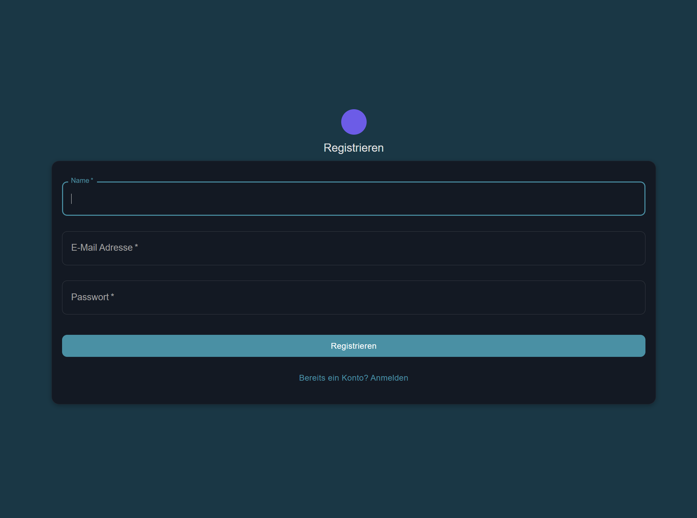

### Login
- Unter **„Anmelden“** (Login) E-Mail und Passwort eingeben.
- Falls **2FA** aktiviert ist: Nach dem Login den zweiten Faktor (TOTP) eingeben. 2FA kann unter **„2FA Setup“** (im Menü unter System) eingerichtet werden.

---

## 5. Organisationen anlegen

Organisationen sind **Unternehmen/Firmen**, die Sie später Leads zuordnen können.

1. Im Menü **„Organizations“** (Organisationen) öffnen.
2. Auf **„Create“** (Anlegen) klicken.
3. Folgende Felder ausfüllen (soweit bekannt):
   - **Name**
   - **Domain**
   - **Industry** (Branche)
   - **Company Size**
   - **Country**
   - **Portal ID** / **Moco ID** (optional, für Integrationen)
4. Speichern.

Die angelegte Organisation kann beim Anlegen oder Bearbeiten eines Leads im Feld **„Company“** (organization_id) ausgewählt werden.

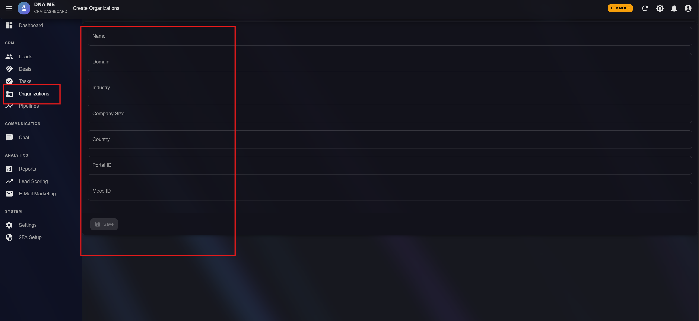
---

## 6. Leads/Kunden anlegen (manuell)

Leads sind Ihre **Kontakte/Kunden**. Sie können sie manuell anlegen oder sie entstehen automatisch, wenn ein unbekannter Absender zuerst schreibt (siehe [Chats](#10-chats--kommunikation)).

### Manuelles Anlegen

1. Im Menü **„Leads“** öffnen.
2. Auf **„Create“** klicken.
3. **Pflichtfeld:** **E-Mail**.
4. Weitere Felder nach Bedarf:
   - **First Name**, **Last Name**, **Phone**, **Job Title**
   - **Company** (Organisation auswählen, falls vorhanden)
   - **LinkedIn URL**
   - **Status** (z. B. New, Contacted, Qualified, Nurturing, Customer, Churned)
   - **Lifecycle Stage** (Lead, MQL, SQL, Opportunity, Customer)
5. Speichern.

Der Lead erscheint in der Lead-Liste und kann in der **Kartenansicht** geöffnet werden.
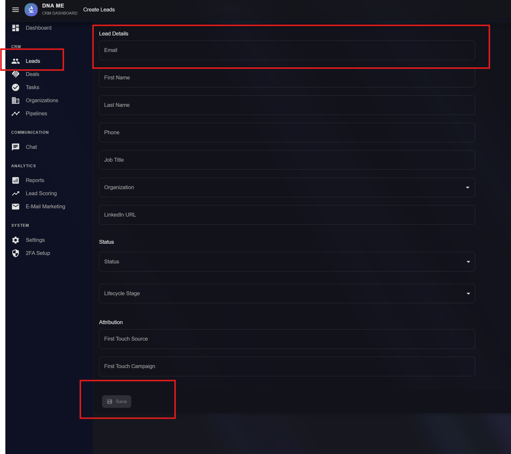
---

## 7. Kartenansicht Lead/Kunde

Wenn Sie einen Lead in der Liste anklicken, öffnet sich die **Detailansicht (Karte)** des Leads.
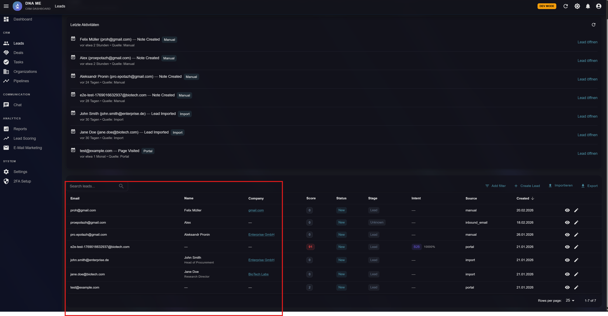
### Wichtige Elemente

- **Kopfbereich:** Name, Status, Lifecycle, ggf. Routing-Status.
- **Score Breakdown** und **Intent Signals** (falls Scoring aktiv ist).
- **Contact Information:** E-Mail, Telefon, Job Title, LinkedIn.
- **Company:** Verknüpfte Organisation (falls gesetzt).
- **Log Activity:** Aktivitäten erfassen (Note, E-Mail, Call, Meeting, Task).

### Button „Chats“

- Oben in der Karte gibt es die Schaltfläche **„Chats“**.
- Ein Klick öffnet ein **Chat-Panel** mit allen **relevanten Chats** zu diesem Lead (aus dem Bereich Kommunikation).
- Dort können Sie die Konversationen mit dem Kunden einsehen und weiterführen.

### Notizen (Notes) – unten in der Karte

- **Unten** in der Lead-Karte befindet sich der Bereich **„Notes“** (Notizen).
- Dort werden **sortierte Einträge** zum Lead angezeigt: manuell erfasste Notizen (Aktivitätstyp „Note“), nach Zeit sortiert (neueste zuerst).
- Über **„Log Activity“** können Sie weitere Notizen (oder E-Mails, Calls, Meetings, Tasks) erfassen; Notizen erscheinen dann in dieser Liste.
- Ein **Aktualisieren-Button** lädt die Notizen neu.

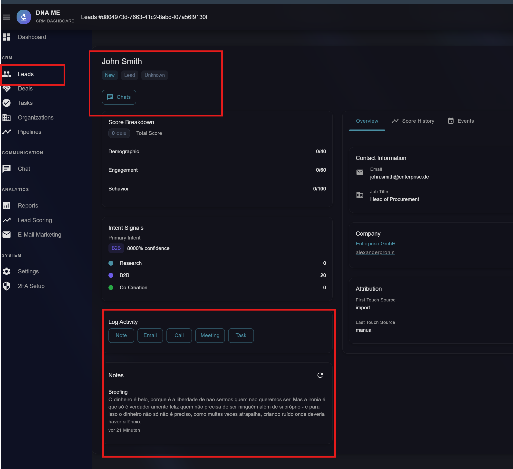

---

## 8. Tasks (in Entwicklung)

Der Menüpunkt **„Tasks“** ist vorhanden und zeigt eine Task-Liste (CRUD über API). Die **volle Funktionalität und UX** (z. B. Zuordnung zu Deals/Leads, Filter, Fälligkeiten) befindet sich noch **in Entwicklung**. Tasks können bereits in der Lead-Karte über „Log Activity“ als Aktivität angelegt werden.

---

## 9. Pipelines

**Pipelines** definieren die **Verkaufsstufen** (Stages) und Metriken für Ihre Deals.

### Was Sie dort sehen

- **Pipelines-Liste:** Alle Pipelines mit Übersicht (z. B. Anzahl Deals, Umsatz, Gewinn/Verlust).
- **Pipeline-Detail:** Ein Klick auf eine Pipeline öffnet die **Detailansicht** mit:
  - **Stages** (Phasen) mit Deal-Anzahl und Werten
  - **Metriken** (z. B. Gesamtumsatz, gewonnene/verlorene Deals, Konversionsrate)
  - **Einstellungen-Link** zu Pipeline-Konfiguration (falls konfiguriert)

### Nutzung

- Pipelines sind die **Vorlage** für die Deal-Phasen. Beim Anlegen eines Deals wählen Sie Pipeline und Stage. Auf dem **Deal-Kanban** werden die Deals nach Stages gruppiert angezeigt; Sie können Deals per Drag & Drop zwischen Stages verschieben.

---

## 10. Chats & Kommunikation

Unter **„Communication → Chat“** befindet sich die **Chat-Übersicht**.

### Aufbau

- **Linke Seite:** Liste der Konversationen mit **Tabs**:
  - **Alle:** alle Konversationen
  - **Direkt:** direkte Konversationen (type = direct)
  - **Intern:** interne Konversationen (type = internal)
  - **Gruppe:** Gruppenkonversationen (type = group)
- **Rechte Seite:** Ausgewählter **Chat** (Verlauf und Eingabefeld).
- **Suche** und **Aktualisieren** in der Seitenleiste.
- **Plus-Button (+):** Neue Konversation anlegen.

### Jeder Chat = Kommunikation mit einem Lead

- Jede Konversation ist einem **Lead** zugeordnet (oder wird einem zugeordnet).
- **Neues E-Mail von einem Kunden:** Wenn der Kunde **zuerst** schreibt und noch **nicht in der Datenbank** ist, kann automatisch eine **Lead-Karte (Kunde)** angelegt werden; die Nachricht erscheint in den Chats.
- In der Lead-Karte öffnet der Button **„Chats“** genau die zu diesem Lead gehörenden Chats.

### Neue Konversation anlegen

1. Auf den **Plus-Button (+)** klicken.
2. **Lead** auswählen (Suche nach Name oder E-Mail; mind. 2 Zeichen).
3. Optional **Betreff** eingeben.
4. **Typ** wählen: Direkt, Intern oder Gruppe.
5. **„Erstellen“** klicken.

Die neue Konversation erscheint in der Liste; Sie können sofort Nachrichten schreiben.

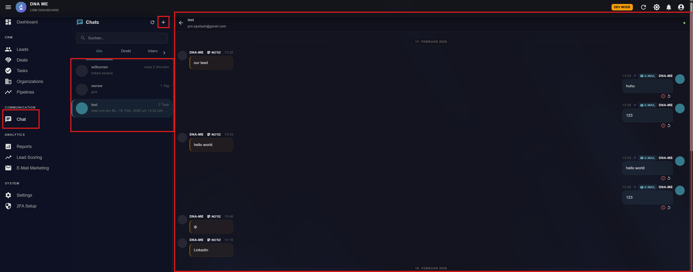
---

## 11. Deals: Listen- und Kanban-Ansicht

Unter **„Deals“** können Sie Deals verwalten. Es gibt **zwei Ansichten**.

### Listenansicht

- **Tabelle** mit Deals: Name, Pipeline, Stage, Wert, Fälligkeit, ggf. E-Mail-Sequenz-Status usw.
- Suche und Filter (z. B. nach Pipeline/Stage).
- **Create:** Neuen Deal anlegen.

### Kanban-Ansicht

- **Umschalter** in der Toolbar (Listen-Icon / Kanban-Icon) wechselt zur **Kanban-Board-Ansicht**.
- Spalten = **Stages** der gewählten Pipeline.
- **Karten** = Deals; Sie können Deals per **Drag & Drop** in eine andere Stage ziehen.
- Beim Bewegen können **Automatisierungen** (Trigger) ausgelöst werden (siehe nächster Abschnitt).

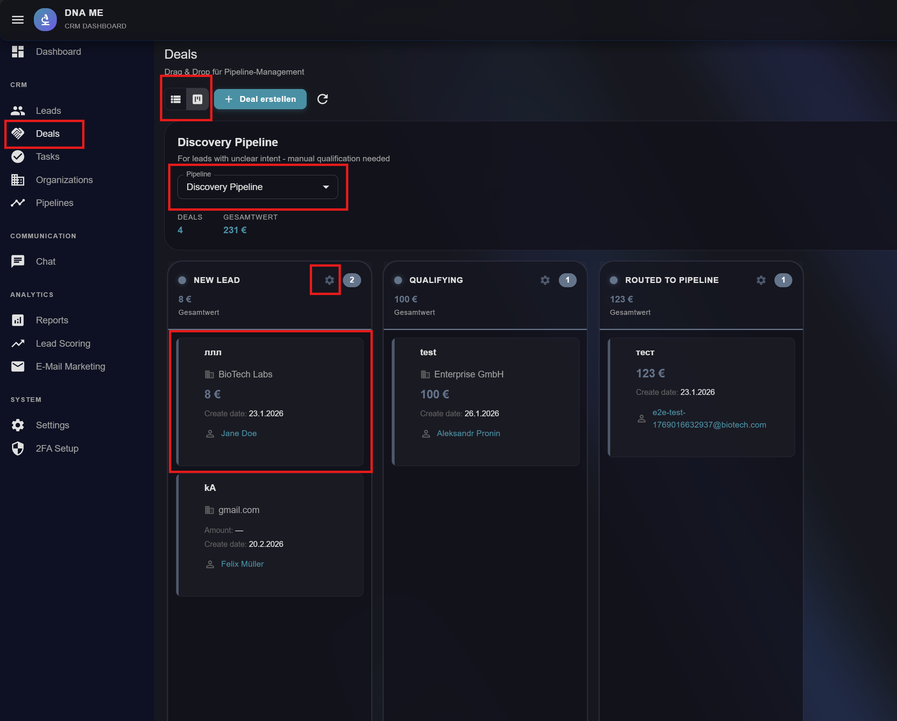
---

## 12. Automatisierungen auf dem Deal-Kanban

Auf dem **Kanban-Board** können pro **Stage** **Automatisierungen (Trigger)** konfiguriert werden. Beim Verschieben eines Deals in eine Stage werden die konfigurierten Aktionen ausgeführt.

### Verfügbare Automatisierungen (Auswahl)

| Aktion | Kurzbeschreibung |
|--------|-------------------|
| **Email Marketing** | Deal in eine **E-Mail-Sequenz** einschreiben. Die Sequenz wird unter „E-Mail Marketing“ angelegt und hier ausgewählt. |
| **Benachrichtigung (E-Mail)** | Derzeit: **E-Mail-Benachrichtigung** an einen fest konfigurierten Empfänger (z. B. fadmin/Admin). Kein Slack mehr. |
| **Moco Kunde erstellen** | Erstellt einen Kunden in **Moco**. |
| **Moco Projekt erstellen** | Erstellt ein Projekt in Moco. |
| **Moco Angebot erstellen** | Erstellt ein Angebot in Moco. |
| **Moco Rechnung (Entwurf)** | Erstellt eine Rechnungsentwurf in Moco (optional mit Titel, Steuer, Fälligkeit, Positionen). |
| **Cituro Buchungslink** (in Entwicklung) | Sendet einen Terminbuchungslink per E-Mail. |

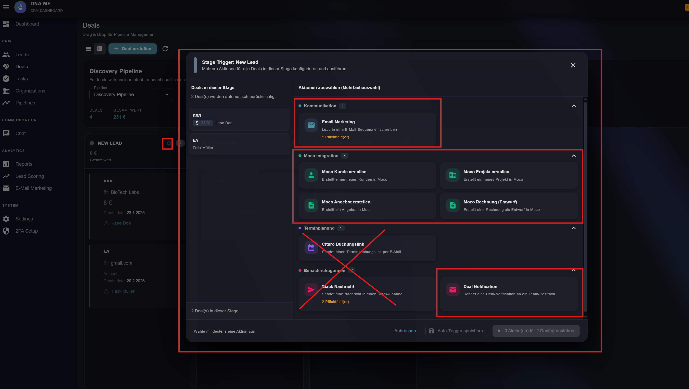

**Hinweis:** **Slack** wird nicht mehr unterstützt und aus dem System entfernt. Benachrichtigungen laufen über E-Mail (z. B. an Admin/fadmin).

### Nutzung

- Beim **Bearbeiten einer Stage** oder über die Kanban-Trigger-Konfiguration (z. B. Zahnrad/„Stage Triggers“) können Sie die gewünschten Aktionen auswählen und Parameter setzen (z. B. welche E-Mail-Sequenz, welche E-Mail-Adresse für Benachrichtigungen).
- Beim **Verschieben** eines Deals in diese Stage laufen die Aktionen automatisch (z. B. E-Mail an fadmin, Einschreibung in Sequenz, Moco-Kunde/Projekt/Angebot/Rechnung).

---

## 13. E-Mail-Marketing (Sequenzen)

Unter **„E-Mail Marketing“** (im Menü unter Analytics) verwalten Sie **E-Mail-Sequenzen** (Ketten von E-Mails).

### Was Sie dort tun können

- **Sequenzen anlegen und bearbeiten** (Name, Beschreibung, Schritte, Trigger).
- **Sequence Builder** öffnen (z. B. über Bearbeiten oder direkte Route): Schritte der Sequenz definieren (Betreff, Inhalt, Verzögerung usw.).
- Sequenzen **aktivieren/deaktivieren**.
- Sequenzen haben typischerweise eine **Schrittzahl** und optional **Trigger** (z. B. manuell, bei Deal-Stage-Wechsel).

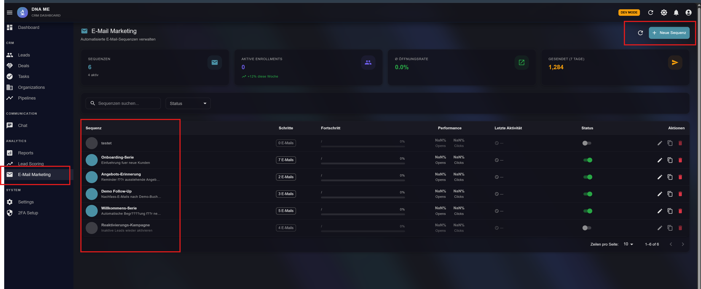

Ein Onboarding Beispiel
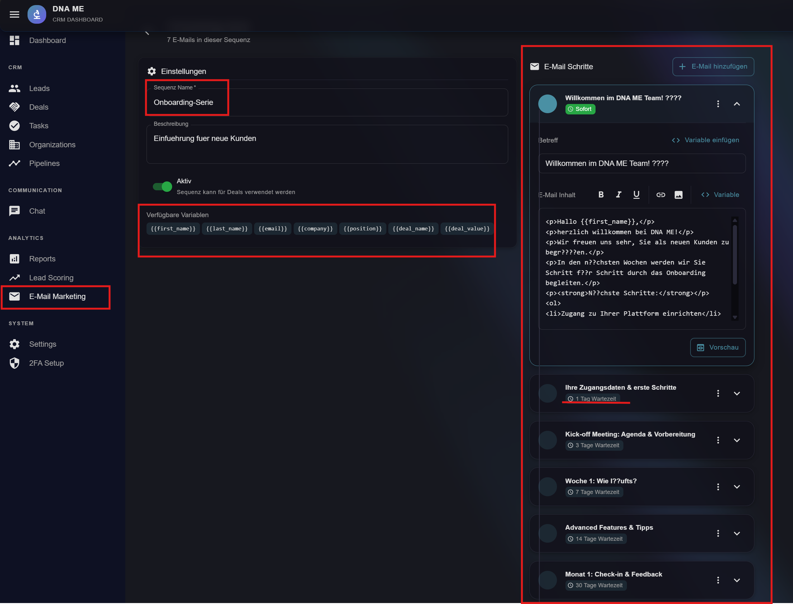

### Verknüpfung mit dem Kanban

- Die hier angelegten **Sequenzen** können in den **Deal-Kanban-Automatisierungen** unter **„Email Marketing“** ausgewählt werden.
- Wenn ein Deal in eine Stage verschoben wird, für die „E-Mail-Sequenz einschreiben“ konfiguriert ist, wird der Deal in die gewählte Sequenz eingeschrieben und erhält die E-Mails der Kette automatisch.

---

## 14. Hinweise zu Integrationen

- **Moco:** Für Angebote, Rechnungen, Kunden und Projekte. Konfiguration z. B. unter Settings → Integrationen (API-Key, Subdomain). Die Automatisierungen auf dem Kanban nutzen diese Anbindung.
- **Slack:** Wird **nicht mehr verwendet** und aus dem System entfernt. Benachrichtigungen erfolgen per E-Mail (z. B. an fadmin/Admin).
- **E-Mail-Versand:** E-Mail-Sequenzen und Benachrichtigungen nutzen die konfigurierten E-Mail-Dienste (z. B. SMTP). E-Mail-Konten pro Nutzer können unter Einstellungen verwaltet werden (IMAP/SMTP für eingehende/ausgehende Mails).

MOCO API
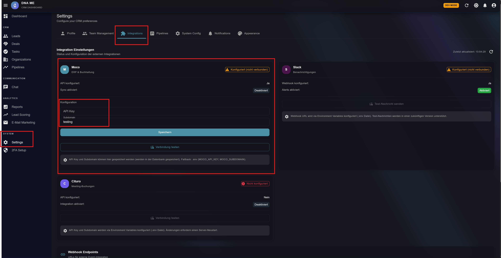
---
