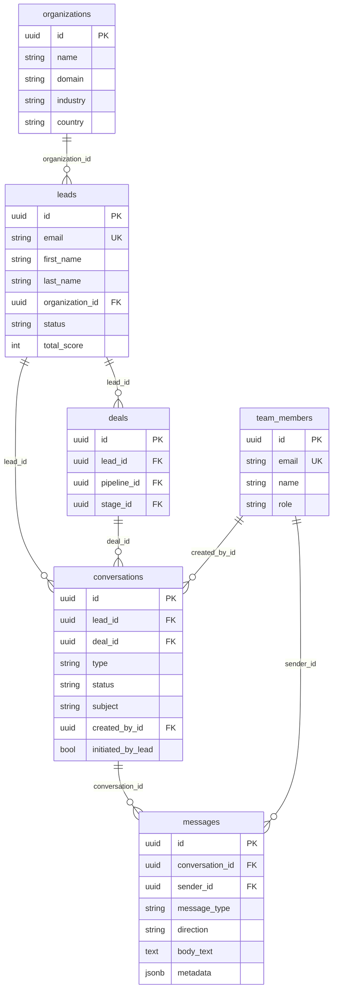

# Datenbankschema – DNA ME CRM

Übersicht, wie **Kontakte (Leads)**, **Organisationen**, **Chats/Konversationen** und **Nachrichten** in der Anwendung organisiert sind.

---

## 1. Kern-Entitäten (vereinfacht)

| Entität | Tabelle | Rolle |
|--------|---------|--------|
| **Organisation** | `organizations` | Firma (Name, Domain, Branche, Land) |
| **Kontakt / Lead** | `leads` | Person (E-Mail, Name, Telefon, Firma → `organization_id`) |
| **Konversation** | `conversations` | Ein Chat-Thread (gehört zu einem Lead oder Deal) |
| **Nachricht** | `messages` | Eine einzelne Nachricht in einer Konversation (E-Mail, LinkedIn, Notiz, Aufgabe) |
| **Team-Mitglied** | `team_members` | CRM-Benutzer (erstellen Konversationen, senden Nachrichten) |
| **Deal** | `deals` | Verkaufsobjekt pro Lead + Pipeline |

---

## 2. Beziehungen (ER-Überblick)

```
organizations (1) ←—— (N) leads
    ↑                        ↑
    |                        | organization_id
    |                        |
leads (1) ←—— (N) conversations    leads (1) ←—— (N) deals
    ↑                |                    ↑
    |                | lead_id            | lead_id
    |                |                    |
    |                ↓                    |
    |         conversations (1) ←—— (N) messages
    |                |                    |
    |                | deal_id (optional)  | conversation_id
    |                ↑                    | sender_id → team_members
    |                |                    |
    +——————— deals (1) ←—— (N) conversations
```

- **Lead** hat genau eine **Organisation** (`organization_id`), eine Organisation hat viele Leads.
- **Lead** hat viele **Konversationen** (`conversations.lead_id`); optional ist eine Konversation einem **Deal** zugeordnet (`conversations.deal_id`).
- **Konversation** hat viele **Nachrichten** (`messages.conversation_id`).
- **Nachrichten** haben optional einen Absender aus dem Team (`messages.sender_id` → `team_members`).

---

## 3. Detaillierte Tabellen

### 3.1 `organizations`

| Spalte | Typ | Beschreibung |
|--------|-----|--------------|
| id | UUID | PK |
| name | VARCHAR(255) | Firmenname |
| domain | VARCHAR(255) | z. B. „example.com“ |
| industry | VARCHAR(100) | Branche |
| company_size | VARCHAR(50) | Firmengröße |
| country | VARCHAR(2) | Ländercode |
| portal_id | VARCHAR(100) | Externe ID (unique) |
| moco_id | VARCHAR(50) | MOCO-Integration |
| metadata | JSONB | Zusatzdaten |
| created_at, updated_at | TIMESTAMPTZ | |

---

### 3.2 `leads` (Kontakte / Kunden)

| Spalte | Typ | Beschreibung |
|--------|-----|--------------|
| id | UUID | PK |
| email | VARCHAR(255) | **UNIQUE**, Pflicht |
| first_name, last_name | VARCHAR(100) | |
| phone | VARCHAR(50) | |
| job_title | VARCHAR(150) | |
| **organization_id** | UUID | FK → organizations(id) |
| status | VARCHAR(50) | z. B. new, contacted, customer |
| lifecycle_stage | VARCHAR(50) | lead, mql, sql, opportunity, customer |
| demographic_score, engagement_score, behavior_score | INTEGER | Scoring |
| total_score | INTEGER | Generiert (Summe) |
| pipeline_id | UUID | FK → pipelines (Routing) |
| routing_status | VARCHAR(50) | z. B. unrouted |
| primary_intent | VARCHAR(50) | research, b2b, co_creation |
| intent_confidence | INTEGER | 0–100 |
| intent_summary | JSONB | Aggregation Intent-Signale |
| first_touch_* / last_touch_* | VARCHAR/TIMESTAMPTZ | Attribution |
| portal_id, waalaxy_id, linkedin_url, lemlist_id | VARCHAR | Externe IDs |
| consent_*, gdpr_* | | Einwilligung/GDPR |
| created_at, updated_at, last_activity | TIMESTAMPTZ | |

---

### 3.3 `conversations` (Chat-Threads)

| Spalte | Typ | Beschreibung |
|--------|-----|--------------|
| id | UUID | PK |
| **lead_id** | UUID | FK → leads(id) ON DELETE CASCADE |
| **deal_id** | UUID | FK → deals(id) ON DELETE CASCADE (optional) |
| type | VARCHAR(50) | 'direct' \| 'group' \| 'internal' |
| status | VARCHAR(50) | 'active' \| 'archived' \| 'closed' |
| subject | VARCHAR(500) | Betreff / Titel |
| participant_emails | JSONB | E-Mail-Adressen Beteiligter |
| last_message_at | TIMESTAMPTZ | Zeit letzter Nachricht |
| created_by_id | UUID | FK → team_members(id) ON DELETE SET NULL |
| initiated_by_lead | BOOLEAN | true = erster Nachricht von Lead |
| created_at, updated_at | TIMESTAMPTZ | |

**Constraint:** `lead_id` oder `deal_id` (oder beide) muss gesetzt sein.

---

### 3.4 `messages` (Nachrichten im Chat)

| Spalte | Typ | Beschreibung |
|--------|-----|--------------|
| id | UUID | PK |
| **conversation_id** | UUID | FK → conversations(id) ON DELETE CASCADE |
| sender_id | UUID | FK → team_members(id), optional (bei intern/Import) |
| message_type | VARCHAR(50) | **'email' \| 'linkedin' \| 'internal_note' \| 'task'** |
| direction | VARCHAR(50) | **'inbound' \| 'outbound' \| 'internal'** |
| status | VARCHAR(50) | draft, sending, sent, error |
| sender_email | VARCHAR(255) | Absender-E-Mail (z. B. bei E-Mail) |
| sender_name | VARCHAR(255) | Absender-Name |
| recipients | JSONB | Empfänger (z. B. to/cc/bcc) |
| subject | VARCHAR(500) | Betreff (v. a. E-Mail) |
| body_html | TEXT | HTML-Inhalt |
| body_text | TEXT | Klartext |
| **metadata** | JSONB | z. B. **imported: true** für importierte Notizen |
| attachments | JSONB | Anhänge |
| external_id | VARCHAR(255) | Externe Nachrichten-ID (E-Mail Message-ID etc.) |
| email_thread_id | VARCHAR(255) | E-Mail-Thread |
| sent_at | TIMESTAMPTZ | Versandzeit |
| read_at, replied_at | TIMESTAMPTZ | Lese-/Antwort-Zeit |
| error_message | TEXT | Fehler beim Versand |
| created_at, updated_at | TIMESTAMPTZ | |

---

### 3.5 `team_members`

| Spalte | Typ | Beschreibung |
|--------|-----|--------------|
| id | UUID | PK |
| email | VARCHAR(255) | UNIQUE |
| name | VARCHAR(255) | |
| role | VARCHAR(50) | |
| region | VARCHAR(50) | |
| is_active | BOOLEAN | |
| max_leads, current_leads | INTEGER | Kapazität |
| created_at, updated_at, deactivated_at | TIMESTAMPTZ | (deactivated_at ggf. in späterer Migration) |

---

### 3.6 Weitere relevante Tabellen (kurz)

- **deals** – `lead_id` → leads, `pipeline_id`, `stage_id` → Pipeline/Stages.
- **events** – `lead_id` → leads; Marketing-/Aktivitäts-Events (partitioniert nach Monat).
- **intent_signals** – `lead_id` → leads; Intent-Erkennung.
- **score_history** – `lead_id` → leads; Verlauf der Scoring-Punkte.
- **tasks** – `lead_id`, optional `deal_id`; Aufgaben.
- **email_accounts** – `team_member_id` → team_members; IMAP/SMTP für E-Mail-Sync.
- **linkedin_connections** – `team_member_id` → team_members; LinkedIn-OAuth.

---

## 4. Mermaid ER-Diagramm (Kern: Kunden, Organisationen, Chats, Nachrichten)



---

## 5. Datenfluss in der Anwendung (kurz)

1. **Kontakt anlegen** → Zeile in `leads`, optional Verknüpfung mit `organizations` über `organization_id`.
2. **Chat starten** → Neue Zeile in `conversations` mit `lead_id` (und optional `deal_id`), `created_by_id` = Team-Mitglied.
3. **Nachricht schreiben/importieren** → Neue Zeile in `messages` mit `conversation_id`, `message_type` (email, linkedin, internal_note, task), `direction`, `body_text`/`body_html`; bei importierten Notizen `metadata.imported = true`.
4. **E-Mail-Sync** → Konversation zu Lead finden oder anlegen, Nachrichten als `message_type = 'email'`, `direction = inbound/outbound` speichern.
5. **CSV-Import mit Nachricht** → Lead anlegen (evtl. Organisation), Worker legt Konversation an und schreibt eine `internal_note` mit `metadata.imported = true`.

Damit sind Kunden (Leads), Organisationen, Chats (Konversationen) und alle Nachrichtentypen in einer konsistenten Schema-Struktur abgebildet.

---

## 6. Bewertung: Nachrichtenspeicherung und CSV-Import mit Nachrichten

### Speicherung der Nachrichten — **richtig**

- **Eine Tabelle** `messages` für alle Typen (E-Mail, LinkedIn, interne Notiz, Aufgabe) mit `message_type` und `direction` ist sinnvoll und vermeidet Redundanz.
- **Konversation als Container** (`conversation_id`): Alle Nachrichten gehören zu einem Thread; Filter und Zugriff pro Lead/Deal sind einfach.
- **Metadata (JSONB)** für Zusatzinfos (z. B. `imported: true`) ist flexibel und wird im Frontend für die Anzeige „Importiert“ genutzt.
- **Referenzen** `sender_id` (optional), `conversation_id` (Pflicht), `recipients`/`body_*` sind konsistent mit dem Rest des Schemas.

### CSV-Import mit Nachrichten — **funktioniert korrekt**

- **Ablauf:** Frontend sendet pro Zeile `message` im Bulk-Payload → API schreibt `initial_message` in die Job-Metadaten → Worker legt/findet Lead, dann Konversation, dann eine Nachricht vom Typ `internal_note` mit `metadata.imported = true`.
- **Bestehender Lead** (z. B. bei „Duplikate überspringen“): `findOrCreateLead` liefert den vorhandenen Lead; die Nachricht wird trotzdem in eine (bestehende oder neue) Konversation dieses Leads geschrieben — gewünschtes Verhalten.
- **Eine Konversation pro Lead (ohne Deal):** `findOrCreateConversation(leadId, null, …)` nutzt eine bestehende aktive Konversation des Leads, falls vorhanden. Importierte Notizen landen damit im gleichen Chat wie E-Mails — alles an einem Ort, mit Kennzeichnung „Importiert“.

### Zu beachtende Punkte

1. **Kein Team-Mitglied:** Wenn keine Zeile in `team_members` existiert (z. B. frischer Install), wird die Notiz nicht in den Chat geschrieben (Worker bricht mit „kein systemUser“ ab). Empfehlung: Mindestens ein aktives Team-Mitglied anlegen oder im Code einen Fall mit `created_by_id = NULL` erlauben, falls das Schema das unterstützt.
2. **Mehrere Zeilen gleiche E-Mail mit Nachricht:** Mehrere Jobs für dieselbe E-Mail erzeugen mehrere Nachrichten in derselben Konversation — korrekt (chronologische Liste importierter Notizen).
3. **Duplikate überspringen:** Bedeutet hier „bestehenden Lead verwenden“, nicht „Zeile ignorieren“. Die Nachricht wird auch bei bestehendem Lead hinzugefügt — sachlich richtig.

**Fazit:** Die Nachrichten werden schema- und fachlich sinnvoll gespeichert; der CSV-Import von Kunden inkl. optionaler Nachricht (als Notiz im Chat) ist konsistent umgesetzt und verhält sich wie intendiert.
