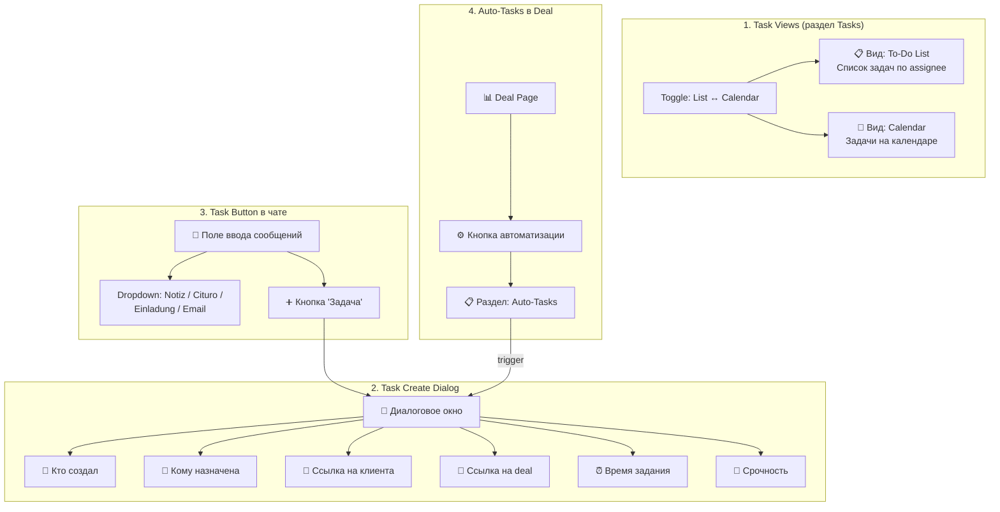
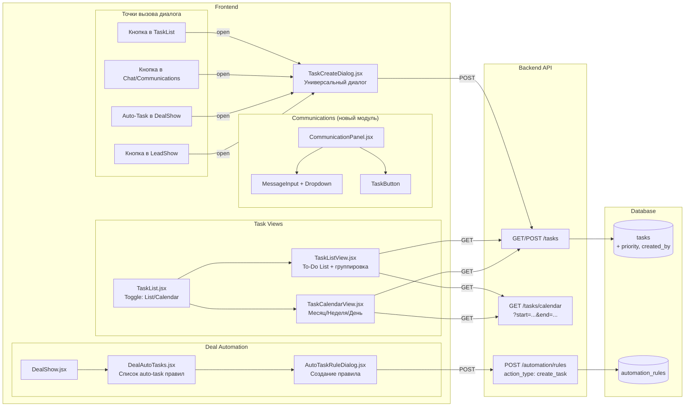

# План разработки: Расширенное управление задачами

## Содержание

1. [Обзор функциональности](#1-обзор-функциональности)
2. [Текущее состояние](#2-текущее-состояние)
3. [Целевая архитектура](#3-целевая-архитектура)
4. [Фаза 1: Расширенные виды задач (List + Calendar)](#фаза-1-расширенные-виды-задач)
5. [Фаза 2: Диалог создания задачи](#фаза-2-диалог-создания-задачи)
6. [Фаза 3: Кнопка задачи в чате / коммуникациях](#фаза-3-кнопка-задачи-в-коммуникациях)
7. [Фаза 4: Автоматическое создание задач в Deal](#фаза-4-автоматическое-создание-задач-в-deal)
8. [Изменения в БД](#изменения-в-бд)
9. [Изменения в API](#изменения-в-api)
10. [Файловая структура](#файловая-структура)
11. [Зависимости (npm-пакеты)](#зависимости)
12. [Оценка трудозатрат](#оценка-трудозатрат)

---

## 1. Обзор функциональности

### Что нужно реализовать



---

## 2. Текущее состояние

### Что уже есть

| Компонент | Статус | Детали |
|-----------|--------|--------|
| Таблица `tasks` в БД | ✅ Готова | Поля: `id`, `lead_id`, `deal_id`, `title`, `description`, `task_type`, `assigned_to`, `due_date`, `status`, `automation_rule_id` |
| `TaskService` (backend) | ✅ Готов | CRUD, search, statistics, overdue, due-soon |
| API Routes `/tasks` | ✅ Готовы | GET, POST, PATCH, DELETE, complete, cancel, reopen |
| `TaskList.jsx` (frontend) | ⚠️ Базовый | Только Datagrid (list view), без Calendar, без Create Dialog |
| Automation Engine | ✅ Готов | `action_type: 'create_task'` уже поддерживается |
| Chat / Communications | ❌ Нет | Модуль коммуникаций (Notiz/Cituro/Einladung/Email) не реализован |

### Что нужно доработать

| Компонент | Изменения |
|-----------|----------|
| Таблица `tasks` | Добавить: `priority`, `created_by` |
| `TaskService` | Добавить фильтрацию по `priority`, `created_by`, calendar range queries |
| API Routes | Добавить: `GET /tasks/calendar` (range-based), расширить `POST /tasks` |
| `TaskList.jsx` | Полностью переписать: добавить Calendar view, toggle, фильтры по assignee |
| `TaskCreateDialog` | Новый компонент |
| `DealShow` / `DealList` | Добавить секцию автоматизации задач |
| Communications module | Новый модуль (Notiz/Cituro/Einladung/Email + Task button) |

---

## 3. Целевая архитектура

### Компоненты и потоки данных



---

## Фаза 1: Расширенные виды задач

### Описание
Раздел Tasks получает два режима отображения: **To-Do List** (список с группировкой) и **Calendar** (месячный/недельный календарь).

### 1.1 To-Do List View

```
┌──────────────────────────────────────────────────────────────┐
│  Tasks                              [📋 List] [📅 Calendar]  │
│  Manage your tasks and to-dos              [+ Create Task]   │
├──────────────────────────────────────────────────────────────┤
│  Filters: [Status ▼] [Assignee ▼] [Priority ▼] [🔍 Search]│
├──────────────────────────────────────────────────────────────┤
│                                                              │
│  ▼ Sarah (BDR) — 3 tasks                                    │
│  ┌──────────────────────────────────────────────────────────┐│
│  │ ☐ Follow up with Dr. Mueller    🔴 High   📅 Feb 26     ││
│  │   └ Lead: mueller@uni.de  Deal: Research Lab #42         ││
│  │ ☐ Send proposal to BioTech GmbH 🟡 Medium 📅 Feb 28     ││
│  │   └ Lead: info@biotech.de  Deal: B2B #15                ││
│  │ ☑ Call Dr. Schmidt              🟢 Low    📅 Feb 24  ✅  ││
│  └──────────────────────────────────────────────────────────┘│
│                                                              │
│  ▼ Max (AE) — 2 tasks                                       │
│  ┌──────────────────────────────────────────────────────────┐│
│  │ ☐ Prepare demo for Lab Corp     🔴 High   📅 Feb 27     ││
│  │   └ Lead: corp@lab.com  Deal: B2B #22                    ││
│  │ ☐ Review contract terms          🟡 Medium 📅 Mar 1      ││
│  │   └ Lead: legal@partner.de  Deal: Co-Creation #8        ││
│  └──────────────────────────────────────────────────────────┘│
│                                                              │
│  ▼ Unassigned — 1 task                                       │
│  ┌──────────────────────────────────────────────────────────┐│
│  │ ☐ Import conference leads        🟡 Medium 📅 Mar 5      ││
│  └──────────────────────────────────────────────────────────┘│
└──────────────────────────────────────────────────────────────┘
```

**Функции:**
- Группировка по `assigned_to` (team member)
- Сворачивание/разворачивание групп
- Checkbox для быстрого complete/reopen
- Цветовые индикаторы приоритета (🔴 High, 🟡 Medium, 🟢 Low)
- Клик на задачу → открытие деталей / редактирование
- Ссылки на Lead и Deal (кликабельные)
- Индикатор просроченных задач (красная подсветка)

### 1.2 Calendar View

```
┌──────────────────────────────────────────────────────────────┐
│  Tasks                              [📋 List] [📅 Calendar]  │
│  [< Prev]  February 2026  [Next >]  [Month] [Week] [Day]   │
├──────┬──────┬──────┬──────┬──────┬──────┬──────┤
│ Mon  │ Tue  │ Wed  │ Thu  │ Fri  │ Sat  │ Sun  │
├──────┼──────┼──────┼──────┼──────┼──────┼──────┤
│      │      │      │      │      │      │  1   │
│      │      │      │      │      │      │      │
├──────┼──────┼──────┼──────┼──────┼──────┼──────┤
│  2   │  3   │  4   │  5   │  6   │  7   │  8   │
│      │      │ 🔴SM │      │      │      │      │
│      │      │ 🟡MK │      │      │      │      │
├──────┼──────┼──────┼──────┼──────┼──────┼──────┤
│  23  │  24  │  25  │  26  │  27  │  28  │      │
│      │ ✅SM │ 🟡SM │ 🔴SM │ 🔴MK │ 🟡SM │      │
│      │      │      │      │      │      │      │
└──────┴──────┴──────┴──────┴──────┴──────┴──────┘

Legend: SM = Sarah, MK = Max  [Assignee Filter ▼]
```

**Функции:**
- Три режима: Month / Week / Day
- Задачи отображаются на дату `due_date`
- Цвет — по assignee (каждый team member = свой цвет)
- Иконка приоритета на каждой задаче
- Клик на задачу → popup с деталями
- Клик на пустую дату → создание задачи с предзаполненной датой
- Фильтр по assignee (показать только задачи конкретного члена команды)
- Просроченные задачи — красная рамка

### 1.3 Необходимые файлы

| Файл | Действие | Описание |
|------|----------|---------|
| `frontend/src/resources/tasks/TaskList.jsx` | Переписать | Добавить toggle List/Calendar, общий layout |
| `frontend/src/resources/tasks/TaskListView.jsx` | Создать | To-Do List с группировкой по assignee |
| `frontend/src/resources/tasks/TaskCalendarView.jsx` | Создать | Календарь на FullCalendar.js |
| `frontend/src/resources/tasks/TaskCard.jsx` | Создать | Карточка задачи (переиспользуется в обоих view) |
| `src/api/routes/tasks.ts` | Расширить | Добавить `GET /tasks/calendar?start=...&end=...` |

### 1.4 Новый API endpoint

```
GET /api/v1/tasks/calendar?start=2026-02-01&end=2026-03-01&assigned_to=sarah@dna-me.com

Response:
{
  "data": [
    {
      "id": "...",
      "title": "Follow up with Dr. Mueller",
      "due_date": "2026-02-26T10:00:00Z",
      "priority": "high",
      "status": "open",
      "assigned_to": "sarah@dna-me.com",
      "assigned_name": "Sarah BDR",
      "lead_email": "mueller@uni.de",
      "lead_name": "Dr. Mueller",
      "deal_name": "Research Lab #42",
      "lead_id": "...",
      "deal_id": "..."
    }
  ]
}
```

### 1.5 npm-зависимости

```bash
cd frontend && npm install @fullcalendar/react @fullcalendar/daygrid @fullcalendar/timegrid @fullcalendar/interaction
```

---

## Фаза 2: Диалог создания задачи

### Описание
Универсальный диалог `TaskCreateDialog`, используемый из всех точек приложения.

### 2.1 Макет диалога

```
┌─────────────────────────────────────────────────────┐
│  ✕                    Neue Aufgabe                   │
├─────────────────────────────────────────────────────┤
│                                                      │
│  Titel *                                             │
│  ┌─────────────────────────────────────────────┐     │
│  │ Follow up Anruf                              │     │
│  └─────────────────────────────────────────────┘     │
│                                                      │
│  Beschreibung                                        │
│  ┌─────────────────────────────────────────────┐     │
│  │ Angebot besprechen und nächste Schritte     │     │
│  │ klären.                                      │     │
│  └─────────────────────────────────────────────┘     │
│                                                      │
│  ┌──────────────────┐  ┌──────────────────────┐     │
│  │ Erstellt von      │  │ Zugewiesen an  *     │     │
│  │ [Auto: current]  │  │ [Sarah BDR    ▼]     │     │
│  └──────────────────┘  └──────────────────────┘     │
│                                                      │
│  ┌──────────────────┐  ┌──────────────────────┐     │
│  │ Fälligkeitsdatum │  │ Priorität     *      │     │
│  │ [📅 26.02.2026 ] │  │ [🔴 Hoch      ▼]    │     │
│  └──────────────────┘  └──────────────────────┘     │
│                                                      │
│  ┌──────────────────┐  ┌──────────────────────┐     │
│  │ Uhrzeit          │  │ Aufgabentyp          │     │
│  │ [🕐 10:00    ]   │  │ [Follow-up   ▼]      │     │
│  └──────────────────┘  └──────────────────────┘     │
│                                                      │
│  Verknüpfungen                                       │
│  ┌──────────────────────────────────────────────┐    │
│  │ 👤 Kunde:  [🔍 Dr. Mueller (mueller@...)  ] │    │
│  │ 💼 Deal:   [🔍 Research Lab #42           ] │    │
│  └──────────────────────────────────────────────┘    │
│                                                      │
│              [Abbrechen]  [✓ Aufgabe erstellen]      │
└─────────────────────────────────────────────────────┘
```

### 2.2 Поля диалога

| Поле | Тип | Обязательное | Источник данных | Описание |
|------|-----|-------------|-----------------|---------|
| `title` | Text Input | ✅ | Ввод пользователя | Название задачи |
| `description` | Textarea | — | Ввод пользователя | Описание задачи |
| `created_by` | Read-only | ✅ | Автоматически (current user) | Кто создал задачу |
| `assigned_to` | Select (Autocomplete) | ✅ | `GET /api/v1/team` | Кому назначена |
| `due_date` | DatePicker | — | Ввод пользователя | Дата выполнения |
| `due_time` | TimePicker | — | Ввод пользователя | Время выполнения |
| `priority` | Select | ✅ | `low` / `medium` / `high` / `critical` | Срочность |
| `task_type` | Select | — | `follow_up` / `call` / `email` / `meeting` / `review` / `other` | Тип задачи |
| `lead_id` | Autocomplete | — | `GET /api/v1/leads?q=...` | Ссылка на клиента |
| `deal_id` | Autocomplete | — | `GET /api/v1/deals?q=...` | Ссылка на deal |

### 2.3 Контекстное предзаполнение

Диалог принимает props для предзаполнения полей, в зависимости от места вызова:

| Место вызова | Предзаполненные поля |
|-------------|---------------------|
| Task List (кнопка "Create Task") | Только `created_by` |
| Lead Detail (LeadShow) | `lead_id`, `created_by` |
| Deal Detail (DealShow) | `deal_id`, `lead_id` (из deal), `created_by` |
| Chat / Communications Panel | `lead_id` (текущий лид), `created_by`, `description` (контекст из чата) |

### 2.4 Компонент

```
frontend/src/components/tasks/TaskCreateDialog.jsx
```

Props:
```js
{
  open: boolean,           // Видимость диалога
  onClose: () => void,     // Закрытие
  onSuccess: (task) => void, // Callback после создания
  // Предзаполнение:
  defaultLeadId?: string,
  defaultDealId?: string,
  defaultAssignedTo?: string,
  defaultDescription?: string,
  defaultDueDate?: string,
  defaultPriority?: 'low' | 'medium' | 'high' | 'critical',
}
```

---

## Фаза 3: Кнопка задачи в коммуникациях

### Описание
Модуль коммуникаций (`CommunicationPanel`) размещается на странице деталей лида (LeadShow). Включает поле ввода сообщения с dropdown (Notiz / Cituro / Einladung / Email) и кнопку создания задачи.

### 3.1 Макет Communication Panel

```
┌─────────────────────────────────────────────────────────────┐
│  Lead: Dr. Mueller (mueller@uni-heidelberg.de)              │
│  ─────────────────────────────────────────────────────────  │
│                                                             │
│  [Timeline событий и коммуникаций]                          │
│                                                             │
│  14:30  📧 Email sent: "Follow-up nach Demo"               │
│  12:00  📝 Notiz: "Interessiert an Research Panel"          │
│  10:15  📞 Cituro: Termin am 28.02 um 15:00                │
│                                                             │
├─────────────────────────────────────────────────────────────┤
│                                                             │
│  ┌─────────────────────────────────────┐ ┌────┐ ┌────────┐ │
│  │ Nachricht eingeben...               │ │ 📎 │ │ ➕ Task│ │
│  └─────────────────────────────────────┘ └────┘ └────────┘ │
│                                                             │
│  Typ: [Notiz ▼]  ( Notiz | Cituro | Einladung | Email )    │
│                                                             │
│                                   [Senden]                  │
└─────────────────────────────────────────────────────────────┘
```

### 3.2 Поведение кнопки "➕ Task"

1. Клик на кнопку → открывается `TaskCreateDialog`
2. Предзаполнение:
   - `lead_id` = текущий лид
   - `deal_id` = активный deal лида (если есть)
   - `created_by` = текущий пользователь
   - `description` = текст из поля ввода (если есть)
3. После создания задачи → задача появляется в timeline

### 3.3 Необходимые изменения в БД

Для хранения коммуникаций нужна **новая таблица**:

```sql
CREATE TABLE communications (
    id              UUID PRIMARY KEY DEFAULT gen_random_uuid(),
    lead_id         UUID NOT NULL REFERENCES leads(id) ON DELETE CASCADE,
    deal_id         UUID REFERENCES deals(id),
    comm_type       VARCHAR(50) NOT NULL, -- 'notiz', 'cituro', 'einladung', 'email'
    subject         VARCHAR(500),
    body            TEXT NOT NULL,
    direction       VARCHAR(10) DEFAULT 'outbound', -- 'inbound', 'outbound', 'internal'
    created_by      VARCHAR(255),
    metadata        JSONB DEFAULT '{}',
    created_at      TIMESTAMPTZ DEFAULT NOW()
);

CREATE INDEX idx_communications_lead ON communications(lead_id, created_at DESC);
CREATE INDEX idx_communications_type ON communications(comm_type);
```

### 3.4 Новые файлы

| Файл | Описание |
|------|---------|
| `frontend/src/components/communications/CommunicationPanel.jsx` | Основная панель коммуникаций |
| `frontend/src/components/communications/CommunicationTimeline.jsx` | Timeline сообщений |
| `frontend/src/components/communications/MessageInput.jsx` | Поле ввода с dropdown типа |
| `frontend/src/components/communications/TaskButton.jsx` | Кнопка создания задачи |
| `src/api/routes/communications.ts` | API routes для CRUD коммуникаций |
| `src/services/communicationService.ts` | Backend service |
| `migrations/XXXXXX_add-communications.sql` | Миграция БД |

### 3.5 Новые API endpoints

```
GET    /api/v1/leads/:id/communications     — получить все коммуникации лида
POST   /api/v1/leads/:id/communications     — создать коммуникацию
GET    /api/v1/communications/:id           — получить одну коммуникацию
DELETE /api/v1/communications/:id           — удалить коммуникацию
```

---

## Фаза 4: Автоматическое создание задач в Deal

### Описание
На странице Deal добавляется секция **Auto-Tasks** — настраиваемые правила автоматического создания задач при определённых триггерах.

### 4.1 Макет на странице Deal

```
┌─────────────────────────────────────────────────────────────┐
│  Deal: Research Lab #42                                      │
│  Pipeline: Research Lab → Stage: Consultation                │
├─────────────────────────────────────────────────────────────┤
│                                                             │
│  [Overview] [Tasks] [Activity] [Auto-Tasks]                 │
│                                                             │
│  ┌─ Auto-Tasks ───────────────────────────────────────────┐ │
│  │                                                         │ │
│  │  ✅ Активные правила (2)                                │ │
│  │                                                         │ │
│  │  ┌───────────────────────────────────────────────┐      │ │
│  │  │ 📋 Follow-up nach Consultation               │      │ │
│  │  │ Trigger: Stage → Consultation                 │      │ │
│  │  │ Assign: Lead Owner | Priority: High           │      │ │
│  │  │ Due: +2 Tage nach Trigger                     │      │ │
│  │  │                        [Bearbeiten] [Löschen] │      │ │
│  │  └───────────────────────────────────────────────┘      │ │
│  │                                                         │ │
│  │  ┌───────────────────────────────────────────────┐      │ │
│  │  │ 📋 Angebot vorbereiten                        │      │ │
│  │  │ Trigger: Stage → Proposal Sent                │      │ │
│  │  │ Assign: Account Executive | Priority: Critical│      │ │
│  │  │ Due: +1 Tag nach Trigger                      │      │ │
│  │  │                        [Bearbeiten] [Löschen] │      │ │
│  │  └───────────────────────────────────────────────┘      │ │
│  │                                                         │ │
│  │              [+ Neue Auto-Task Regel]                   │ │
│  └─────────────────────────────────────────────────────────┘ │
└─────────────────────────────────────────────────────────────┘
```

### 4.2 Диалог создания Auto-Task правила

```
┌─────────────────────────────────────────────────────┐
│  ✕              Neue Auto-Task Regel                 │
├─────────────────────────────────────────────────────┤
│                                                      │
│  Regelname *                                         │
│  ┌─────────────────────────────────────────────┐     │
│  │ Follow-up nach Consultation                  │     │
│  └─────────────────────────────────────────────┘     │
│                                                      │
│  ── Trigger ──                                       │
│  Wann soll die Aufgabe erstellt werden?              │
│                                                      │
│  Trigger-Typ: [Stage-Wechsel ▼]                      │
│    ( Stage-Wechsel | Score-Schwelle |                 │
│      Intent erkannt | Zeitbasiert )                   │
│                                                      │
│  Stage: [Consultation ▼]                             │
│                                                      │
│  ── Task Template ──                                 │
│  Welche Aufgabe soll erstellt werden?                │
│                                                      │
│  Titel:    [Follow-up Anruf mit {lead_name}   ]     │
│  Beschr.:  [Ergebnisse besprechen und...]            │
│                                                      │
│  Zuweisen an:                                        │
│  (●) Lead Owner   ( ) Bestimmte Person               │
│  ( ) Deal Owner   ( ) Round-Robin                    │
│                                                      │
│  Priorität: [🔴 Hoch ▼]                             │
│                                                      │
│  Fälligkeit: [+2] Tage nach Trigger                  │
│                                                      │
│  ── Variablen ──                                     │
│  Verfügbare Platzhalter:                             │
│  {lead_name} {lead_email} {deal_name}                │
│  {deal_value} {pipeline_name} {stage_name}           │
│  {assigned_to} {trigger_date}                        │
│                                                      │
│         [Abbrechen]  [✓ Regel erstellen]             │
└─────────────────────────────────────────────────────┘
```

### 4.3 Как это работает в backend

Auto-Task правила используют существующий `AutomationEngine`:

```
automation_rules:
  trigger_type: 'stage_change'
  trigger_config: { "to_stage": "consultation" }
  action_type: 'create_task'
  action_config: {
    "title_template": "Follow-up Anruf mit {lead_name}",
    "description_template": "Ergebnisse besprechen...",
    "assign_strategy": "lead_owner",
    "priority": "high",
    "due_days_offset": 2
  }
```

Когда deal перемещается в stage "Consultation":
1. `AutomationEngine.processStageChange()` срабатывает
2. Находит matching правило
3. Создаёт task через `TaskService.createTask()`
4. Подставляет переменные (`{lead_name}`, `{deal_name}`, и т.д.)

### 4.4 Новые файлы

| Файл | Описание |
|------|---------|
| `frontend/src/resources/deals/DealShow.jsx` | Страница деталей deal (новая или расширить) |
| `frontend/src/resources/deals/DealAutoTasks.jsx` | Секция Auto-Tasks в DealShow |
| `frontend/src/components/automation/AutoTaskRuleDialog.jsx` | Диалог создания auto-task правила |

### 4.5 Изменения в AutomationEngine

Расширить `action_config` для `create_task`:

```typescript
interface CreateTaskActionConfig {
  title_template: string;          // "Follow-up mit {lead_name}"
  description_template?: string;
  assign_strategy: 'lead_owner' | 'deal_owner' | 'specific' | 'round_robin';
  assign_to?: string;              // email, если strategy = 'specific'
  priority: 'low' | 'medium' | 'high' | 'critical';
  due_days_offset: number;         // +N дней от триггера
  task_type?: string;
}
```

Переменные для подстановки:

| Переменная | Описание | Пример |
|-----------|---------|--------|
| `{lead_name}` | Имя + Фамилия лида | Dr. Mueller |
| `{lead_email}` | Email лида | mueller@uni.de |
| `{deal_name}` | Название deal | Research Lab #42 |
| `{deal_value}` | Стоимость deal | €15,000 |
| `{pipeline_name}` | Название pipeline | Research Lab |
| `{stage_name}` | Название текущего stage | Consultation |
| `{assigned_to}` | Назначенный менеджер | sarah@dna-me.com |
| `{trigger_date}` | Дата срабатывания | 2026-02-26 |
| `{created_by}` | Кто создал правило | admin@dna-me.com |

---

## Изменения в БД

### Миграция 1: Расширение таблицы tasks

```sql
-- Добавить priority и created_by в tasks
ALTER TABLE tasks ADD COLUMN priority VARCHAR(20) DEFAULT 'medium';
ALTER TABLE tasks ADD COLUMN created_by VARCHAR(255);

-- Индекс для calendar view queries
CREATE INDEX idx_tasks_due_date_range ON tasks(due_date)
  WHERE status NOT IN ('completed', 'cancelled');

-- Индекс для группировки по assignee
CREATE INDEX idx_tasks_assigned_priority ON tasks(assigned_to, priority, due_date);
```

### Миграция 2: Таблица communications

```sql
CREATE TABLE communications (
    id              UUID PRIMARY KEY DEFAULT gen_random_uuid(),
    lead_id         UUID NOT NULL REFERENCES leads(id) ON DELETE CASCADE,
    deal_id         UUID REFERENCES deals(id),
    comm_type       VARCHAR(50) NOT NULL,
    subject         VARCHAR(500),
    body            TEXT NOT NULL,
    direction       VARCHAR(10) DEFAULT 'outbound',
    created_by      VARCHAR(255),
    metadata        JSONB DEFAULT '{}',
    created_at      TIMESTAMPTZ DEFAULT NOW()
);

CREATE INDEX idx_communications_lead ON communications(lead_id, created_at DESC);
CREATE INDEX idx_communications_type ON communications(comm_type);
```

---

## Изменения в API

### Расширить существующие

| Endpoint | Изменение |
|----------|----------|
| `POST /api/v1/tasks` | Добавить поля `priority`, `created_by` в schema |
| `GET /api/v1/tasks` | Добавить фильтр `priority`, сортировку по `priority` |
| `PATCH /api/v1/tasks/:id` | Добавить `priority` в update schema |

### Новые endpoints

| Метод | Endpoint | Описание |
|-------|----------|---------|
| GET | `/api/v1/tasks/calendar` | Задачи для календаря (range-based) |
| GET | `/api/v1/tasks/grouped` | Задачи сгруппированные по assignee |
| GET | `/api/v1/leads/:id/communications` | Коммуникации лида |
| POST | `/api/v1/leads/:id/communications` | Создать коммуникацию |
| GET | `/api/v1/communications/:id` | Одна коммуникация |
| DELETE | `/api/v1/communications/:id` | Удалить коммуникацию |

---

## Файловая структура

### Новые и изменённые файлы

```
frontend/src/
├── resources/tasks/
│   ├── TaskList.jsx              ← ПЕРЕПИСАТЬ (toggle List/Calendar)
│   ├── TaskListView.jsx          ← СОЗДАТЬ (To-Do List view)
│   ├── TaskCalendarView.jsx      ← СОЗДАТЬ (Calendar view)
│   └── TaskCard.jsx              ← СОЗДАТЬ (карточка задачи)
│
├── resources/deals/
│   ├── DealList.jsx              ← СУЩЕСТВУЕТ
│   ├── DealShow.jsx              ← СОЗДАТЬ (детали deal + tabs)
│   └── DealAutoTasks.jsx         ← СОЗДАТЬ (секция auto-tasks)
│
├── components/
│   ├── tasks/
│   │   └── TaskCreateDialog.jsx  ← СОЗДАТЬ (универсальный диалог)
│   │
│   ├── communications/
│   │   ├── CommunicationPanel.jsx    ← СОЗДАТЬ
│   │   ├── CommunicationTimeline.jsx ← СОЗДАТЬ
│   │   ├── MessageInput.jsx          ← СОЗДАТЬ
│   │   └── TaskButton.jsx            ← СОЗДАТЬ
│   │
│   └── automation/
│       └── AutoTaskRuleDialog.jsx    ← СОЗДАТЬ
│
└── providers/
    └── dataProvider.js           ← РАСШИРИТЬ (новые API методы)

src/
├── api/routes/
│   ├── tasks.ts                  ← РАСШИРИТЬ (calendar, grouped, priority)
│   └── communications.ts        ← СОЗДАТЬ
│
├── services/
│   ├── taskService.ts            ← РАСШИРИТЬ (calendar queries, grouped)
│   ├── communicationService.ts   ← СОЗДАТЬ
│   └── automationEngine.ts      ← РАСШИРИТЬ (template variables)
│
├── types/index.ts                ← РАСШИРИТЬ (Communication, TaskPriority)
│
└── api/schemas/
    └── communications.ts         ← СОЗДАТЬ (Zod schemas)

migrations/
├── XXXXXX_add-task-priority.sql      ← СОЗДАТЬ
└── XXXXXX_add-communications.sql     ← СОЗДАТЬ
```

---

## Зависимости

### Frontend

```bash
cd frontend
npm install @fullcalendar/react @fullcalendar/daygrid @fullcalendar/timegrid @fullcalendar/interaction
npm install @fullcalendar/list
```

### Backend

Дополнительных зависимостей не требуется.

---

## Оценка трудозатрат

| Фаза | Описание | Сложность | Оценка |
|------|---------|----------|--------|
| **Фаза 1** | Task List View + Calendar View | Средняя | 3-4 дня |
| **Фаза 2** | TaskCreateDialog (универсальный) | Средняя | 2-3 дня |
| **Фаза 3** | Communications Module + Task Button | Высокая | 4-5 дней |
| **Фаза 4** | Deal Auto-Tasks + Rule Dialog | Средняя | 3-4 дня |
| **Миграции + API** | БД изменения + API endpoints | Низкая | 1-2 дня |
| **Тестирование** | E2E + UI testing | Средняя | 2-3 дня |
| | | **Итого:** | **15-21 день** |

### Рекомендуемый порядок

```mermaid
gantt
    title План реализации Task Management
    dateFormat  YYYY-MM-DD
    axisFormat  %d.%m

    section БД + API
    Миграции БД (priority, communications)   :db1, 2026-02-26, 1d
    API: tasks/calendar, tasks/grouped       :api1, after db1, 1d
    API: communications CRUD                  :api2, after api1, 1d

    section Фаза 2 (Dialog — нужен первым)
    TaskCreateDialog                          :f2, after db1, 3d

    section Фаза 1 (Views)
    TaskListView (To-Do List)                 :f1a, after f2, 2d
    TaskCalendarView (Calendar)               :f1b, after f1a, 2d
    TaskList toggle + integration             :f1c, after f1b, 1d

    section Фаза 4 (Deal Auto-Tasks)
    DealShow + DealAutoTasks                  :f4a, after api2, 2d
    AutoTaskRuleDialog                        :f4b, after f4a, 2d
    AutomationEngine template vars            :f4c, after f4b, 1d

    section Фаза 3 (Communications)
    CommunicationService + API                :f3a, after api2, 2d
    CommunicationPanel + Timeline             :f3b, after f3a, 2d
    MessageInput + TaskButton                 :f3c, after f3b, 1d

    section Testing
    E2E + UI Testing                          :test, after f3c, 3d
```

### Зависимости между фазами

```
Фаза 2 (Dialog) → не зависит ни от чего, нужна для всех остальных фаз
Фаза 1 (Views)  → зависит от Фазы 2 (TaskCreateDialog)
Фаза 4 (Auto)   → зависит от Фазы 2 + API изменений
Фаза 3 (Chat)   → зависит от Фазы 2 + новой таблицы communications
```

---

## Примечания

1. **Communications module** — самая крупная новая функциональность. Можно реализовать как отдельную фичу и вынести в Phase 2 проекта, если нужно быстрее получить Task views.

2. **Cituro интеграция** — для реального бронирования встреч через Cituro потребуется отдельная интеграция с их API. В рамках этого плана Cituro — это тип коммуникации (запись о встрече), а не полная интеграция.

3. **Real-time updates** — для обновления календаря и списка в реальном времени (когда другой пользователь создаёт задачу) можно добавить WebSocket / SSE в будущем.

4. **Локализация** — UI labels в плане указаны на немецком (Aufgabe, Fälligkeitsdatum и т.д.), так как CRM ориентирован на немецкий рынок. Можно использовать i18n для поддержки нескольких языков.
